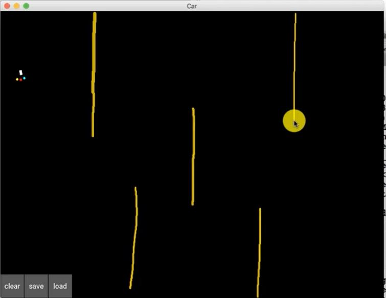

# AI SelfDrivingCar
Implamenting Deep Q Learning to train a virutal self driving car

## Try it Out!
1. Clone this repo
2. Download dependenices
3. Navigate to ./map.py and run
4. Press Load to 'load' a map
5. Draw obsacles by clicking

## Resources/Libraries
### numpy
### matplotlib.pyplot
### kivy
### pytourch
